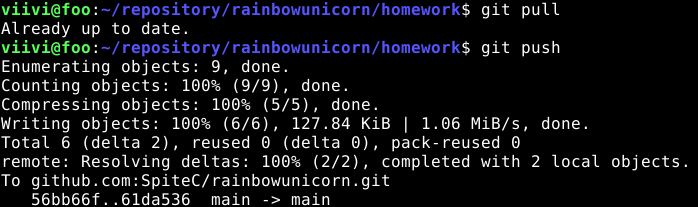
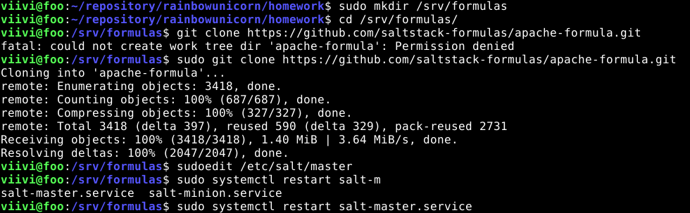

# Palvelinten Hallinta - Harjoitus 3

`echo "Testing this markdown down."`


## z) Lue ja tiivistä


[Commonmark contributors: Markdown Reference](https://commonmark.org/help/)

* Koottu esimerkkilista markdownin formatoinnista
* Headings, code inline/block, link, image
* 10 minuutin tutoriaalilinkki


## a) MarkDown. Tee tämän tehtävän raportti MarkDownina. Helpointa on tehdä raportti GitHub-varastoon, jolloin md-päätteiset tiedostot muotoillaan automaattisesti. Tyhjä rivi tekee kappalejaon, risuaita ‘#’ tekee otsikon, sisennys merkitsee koodinpätkän.


Aloitin harjoituksen luomalla virutaalikoneelleni uuden SSH avaimen kuten tunnilla käytiin läpi, jotta voisin kloonata luodun repon omalle koneelleni sen avulla.

`ssh-keygen -r ecdsa -C "pyry.rauhala@myy.haaga-helia.fi"`

Komennossa luodaan siis uusi ecdsa -avain sen hetkiseen hakemistoon ja lopussa annan sähköpostiosoitteen. Komento luo avaimen .ssh hakemistoon, joka piilotettu normaalinäkymästä. Tämän jälkeen kopioin luodun .pub avaimen githubin asetuksiin ja kloonasin repon SSH linkillä seuraavaan tapaan:

`git clone git@github.com:SpiteC/rainbowunicorn.git`

Kun repo oli kloonattu, navigoin sen hakemistoon ja loin sinne uuden "homework" hakemiston ja tämän .md tiedoston. Testasin muutaman kerran alkuun miten formatointi toimii ja pienen harjoittelun jälkeen kaikki perushommat olivatkin jo hallussa.


## b) Pull first. Tee useita muutoksia git-varastoosi. Tee muutama muutos, jossa yksi commit koskee useampaa tiedostoa. Anna hyvä kuvaukset (commit message), yksi englanninkielinen lause imperatiivissa (määräysmuodossa) "Add top level menu to Foobar synchronizer"


Tässä tehtävässä loin uuden kansion nimeltä "pictures", jonne aion tallettaa kuvankaappaukset tätä tehtävää varten. Kuvankaappauksia varten asensin iamgemagick nimisen työkalun.

```
mkdir pictures
sudo apt-get -y install imagemagick
```

Seuraavaksi loin työkalulla kuvankaappauksen komentoikkunasta ja tallensin sen pictures kansioon. Lisäsin kuvan myös tähän, jolla sain useamman muutoksen gittiin.


Sitten lisäsin kaikki tekemäni muutokset lokaalisti ja committasin ne HEADiin kuvaavalla ja simppelillä viestillä.


Lopuksi suoritin ensin 'git pull' -komennon, jotta tiedostoni ovat varmasti ajantasalla ennen omien muutoksien pushaamista. Komento suoriutui ja ilmoitti, että olen ajantasalla, jonka jälkeen pystyin turvallisin mielin siirtyä 'git push' -komentoon. Kaikki suoriutui ilman virheitä.

 

Kokonaisuudessaan git -komennot menivät siis seuraavassa järjestyksessä:

```
git add *
git commit -m "message"
git pull
git push
```

## c) Kaikki kirjataan. Näytä omalla git-varastollasi esimerkit komennoista ‘git log’, ‘git diff’ ja ‘git blame’. Selitä tulokset. 


Ensimmäisenä käydään läpi 'git log':


Kuvassa on kolme eri aikaan suoritettua committia. Jokaisella on oma pitkä uniikki id. Toisella rivillä löytyy commitin author eli kuka on tehnyt kyseisen muutoksen. Kolmannelta riviltä löytyy päivämäärä, aika, vuosi ja aikavyöhyke tehdylle muutokselle. Viimeisenä jokaiselle commitille on annettu viesti, jossa kuvataan lyhyesti imperatiivissa tehty muutos. 

Seuraavaksi on vuorossa 'git diff':


Kuvassa on alku komennon tuloksesta sillä se oli hieman liian pitkä tuloste laittaa yhdeksi kuvaksi kokonaan. Tästä kuitenkin nähdään komennon tarkoitus eli se siis listaa eron lokaalin ja githubissa olevan version välillä. Tässä tapauksessa olen tehnyt muutoksia tähän .md tiedostoon, jotka se listaa lisäyksinä '+' merkein. Jos jotain olisikin poistettu esimerkiksi tiedostosta niin sitä indikoitaisiin '-' merkein.

Kolmantena ja viimeisenä tehtävän komentona on 'git blame':


Kyseinen komento vaatii attribuutiksi tarkasteltavan tiedoston tai hakemiston. Valitsin tässä tapauksessa tämän tehtävätiedoston. Tuloksena on rivi riviltä tiedoston läpikäynti. Jokaisella rivillä on oma lyhennetty commit id, eli minkä commitin yhteydessä rivi luotiin. ID:n jälkeen tulee rivin luoja, aika, päivämäärä ja aikavyöhyke sekä rivin sisältö. Tällä komennolla on siis nimensä mukaan helpompi "syyttää" muutoksen tekijää eli siis tosiasiassa ohjeistaa häntä tekemään jatkossa paremmin.


## d) Huppis! Tee tyhmä muutos gittiin, älä tee commit:tia. Tuhoa huonot muutokset ‘git reset --hard’. Huomaa, että tässä toiminnossa ei ole peruutusnappia.


Päätin tätä tehtävää varten poistaa kokonaan kuvakansioni lokaalisti, jotta muutos olisi helppo todentaa. Hakemiston poisto onnistui komennolla:

`rm -r pictures/`


Kuvassa nähdään kuinka hakemiston poisto onnistui eikä sitä löytynyt enää hakemistopuustani. Tämän jälkeen käytin komentoa 'git reset --hard' eli pakotin repon menemään takaisin netistä löytyvään viimeisimpään versioon. Kuvat löytyivät taas kansiostaan, hurraa!


## e) Formula


En aluksi tästä tehtävästä oikein ymmärtänyt mikä on päätavoite, muuta kuin että olisi tarkoitus tehdä uusi tilafunktio saltille, joita harjoittelimme jo edellisessä tehtävässä. Tehtävä siis tuntui liian simppeliltä. Lähtiessäni tutkimaan asiaa tarkemmin, löysin kuitenkin, että kyseessä on uusi toiminto jota emme olleet vielä käyttäneet, joten aloitin formula repon lisäyksestä lähteen ohjeen mukaan. ([Lähde](https://docs.saltproject.io/en/latest/topics/development/conventions/formulas.html))



Ensiksi luotiin uusi hakemisto formuloille. Sitten navigoitiin luotuun hakemistoon ja kloonattiin valmis repo, josta löytyi formula apachen konfigurointia varten. Lopuksi polku formula hakemistoon lisättiin masterin konfigurointitiedostoon.

Tämän jälkeen käytin formulaa luomassani simppelissä tilafunktiotiedostossani ja ajoin sen minionilla:


Kuvasta huomataan että 12 muutosta tehtiin, jotka olivat apache formulan erinäisiä asennuksia. Kaksi pieleen mennyttä johtuivat, kun olin nimennyt 'require' kentän paketin väärin ja en ollut antanut 'testifilu.txt' tiedostolle absoluuttista tiedostopolkua. Nämä korjautuivat pienillä muutoksilla, jotka löytyivät jo yllä olevasta tilafunktion kuvasta.


## Lähteet:

CommonMark Help Page: Commonmark contributors: Markdown Reference. https://commonmark.org/help/

Roger Dudler, 2015: git - the simple guide. https://rogerdudler.github.io/git-guide/

SaltStack Documentation: Salt Formulas. https://docs.saltproject.io/en/latest/topics/development/conventions/formulas.html
